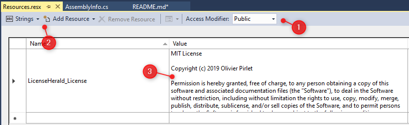
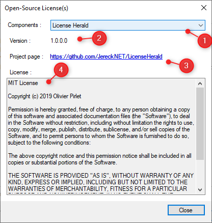

#  License Herald
License Herald makes it easy to retrive the license information of the components used in your .NET project.

* [Installation](#installation)
* [User Guide](#user-guide)
  * [For the component developper](#for-the-component-developper)
  * [For the component consumer](#for-the-component-consumer)
* [License](#license)

## Installation
//TODO

## User Guide

### For the component developper
First, you need to install the LicenseHerald package (see [Installation]("installation)).

Then you need to add  a public resource file in your project, and a string resource containing the text of your license.


Finally, in your `AssemblyInfo.cs` file (for .NET Framework), or in any code file (for .NET Standard), add a reference to the License Herald namespace and the ComponentHerald attribute :
```csharp
using JereckNET.LicenseHerald;
...
[assembly: ComponentHerald("{Your project name}", typeof({YourComponentClass}), "{Your project homepage URL}", typeof({YourResourceClass}),  nameof({YourResourceLicenseName}))]
```

#### Sample `AssemblyInfo.cs`
```csharp
using JereckNET.LicenseHerald;
using JereckNET.LicenseHerald.Properties;
...
[assembly: ComponentHerald("License Herald", 
    typeof(ComponentHeraldAttribute), 
    "https://github.com/JereckNET/LicenseHerald", 
    typeof(Resources), 
    nameof(Resources.LicenseHerald_License))]
```

### For the component consumer
First, you need to install the LicenseHerald package (see [Installation]("#installation)).

Anywhere in your code, you can call the extension method `GetLicensedComponent()` added to the `Assembly` class.

That method will iterate through the target assembly and all of its referenced assemblies and will return a `IList<LicensedComponent>` value.

The `LicensedComponent` class has four public properties :

Property | Description
-------- | -----------
Name | The name of the component, as described in the component's assembly's ComponentHerald attribute ;
Version | The version of the component, directly extracted from the component's assembly ;
HomePage | The project homepage url, as described in the component's assembly's ComponentHerald attribute ;
License | The text of the component's license, extracted from the component's public resource.

### Sample consumer usage


As `GetLicensedComponent()`returns an `IList` object, it can be used to fill a drop-down list through its DataSource property.

```csharp
public Form1(){
    var components = Assembly.GetExecutingAssembly().GetLicensedComponent();

    comboBox1.DataSource = components;
}
...
private void comboBox1_SelectedIndexChanged(object sender, System.EventArgs e) {
	LicensedComponent component = comboBox1.SelectedItem as LicensedComponent;

	label1.Text = component.Version.ToString();
	linkLabel1.Text = component.HomePage;
	linkLabel1.Links.Clear();
	linkLabel1.Links.Add(new LinkLabel.Link {
		LinkData = component.HomePage
	});
	textBox1.Text = component.License;
}

```

## License

License Herald is licensed under the MIT License - the details are at [LICENSE.md](LICENSE.md)